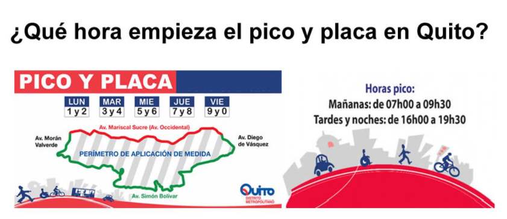

# Pico y Placa Predictor

> This app helps people to check the day and time that they can go out with their cars in the city of Quito, Ecuador.
The information was taken from the picture below. Also, taking in mind that this limit occurs from 6:00 to 20:00 hours. Before and after these hours there is free mobilisation.

## Built With

- HTML
- CSS
- Bootstrap
- Javascript

## Live Demo

[Live Demo Link](https://alejandrotoledoweb.github.io/Pico-y-Placa-Predictor/)

## Prerequisites

- Code Editor like Sublime, VSCode.

## Getting Started

To get a copy of the code please run this command on your terminal or windows powershell `https://github.com/alejandrotoledoweb/Pico-y-Placa-Predictor.git`

Go to the directory of the project running `cd Pico-y-Placa-Predictor` or open this folder in your code editor program.

Then, go to the feature-predictor branch by running this command `git checkout feature-predictor`

## Setup

To start using with the app you have to go the app directory and open the `index.html` file in your internet browser of choice.(ex.: Google Chrome)

## Authors

👤 **Alejandro Toledo**

- GitHub: [@alejandrotoledoweb](https://github.com/alejandrotoledoweb)
- Twitter: [@alejot](https://twitter.com/alejot)
- LinkedIn: [Alejandro Toledo](https://www.linkedin.com/in/alejandro-toledo-3b444b109/)

## 🤝 Contributing

Contributions, issues, and feature requests are welcome!

Feel free to check the [issues page](https://github.com/alejandrotoledoweb/Pico-y-Placa-Predictor/issues).

## Show your support

Give a ⭐️ if you like this project!

## 📝 License

This project is [MIT](lic.url) licensed.
